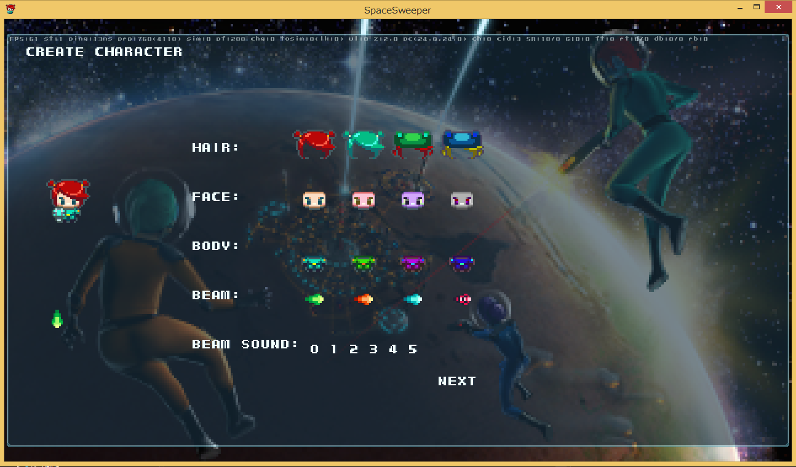

スペース・スウィーパーのセットアップ
====

1. 外部モジュールをgitで取得する
2. 外部モジュール(moyai)をビルドする
3. スペース・スウィーパーのゲームをビルドする
4. バックエンドサーバーをビルドする
5. バックエンドサーバーを起動する
6. ゲームを起動する


### 1. 外部モジュールをgitで取得する
GitHubの標準的な方法で取得します。サブモジュールも必要です。
Unix系を含むコマンドライン版gitを使う場合は、次のコマンドを入力すると、moyaiの必要なバージョンを取得できます。

~~~
git submodule update --init --recursive
~~~


### 2. 外部モジュール(moyai)をビルドする
[moyaiのREADMEファイル](https://github.com/kengonakajima/moyai)　を参照してください。MacOS X, Windowsでビルド可能です。

### 3. スペース・スウィーパーのゲームをビルドする
```cl/sswin/sswin.sln``` を使用して下さい。
MacOS Xでは、clディレクトリで ```make depend;make```でビルドできます。

### 4. バックエンドサーバーをビルドする
MacOS, Linuxでビルド可能です。vceディレクトリでmakeした後、svディレクトリでmakeします。

### 5. バックエンドサーバーを起動する
sv/ssvがバックエンドサーバーの本体です。
起動する前に、sv/datadirディレクトリに移動して ruby mkdir.rbを実行し、必要なディレクトリを作ります。
次に以下のようなコマンドラインで起動します。
使用方法は引数を与えずに起動すると表示されます。

~~~
./ssv realtime database --maxcon=10
~~~

バックエンドサーバーは、
```localhost``` において Redisサーバーが起動していることが必要です。
LinuxにおいてRedisをインストールした後、redis-server等のコマンドを用いて起動してください。

### 6. ゲームを起動する
MacOSでは、clディレクトリで ssというバイナリができています。
Windowsではsswin.slnでデバッグ起動するだけで実行可能です。
バックエンドサーバーに接続するために接続先のアドレスを教える必要があります。
以下のようにコマンドライン引数を追加します。

~~~
--dbhost=localhost --rthost=localhost --username=nobita --debug
~~~

起動に成功すると、キャラクター作成画面が表示されます。




ゲームの起動オプション一覧
====

- ```--username=STRING ```  ユーザー名を指定します。これはゲームデータを保存する単位で、上位のシステムによって排他制御されている必要があります。
- ```--dbhost=HOSTNAME``` バックエンドサーバーのデータベース機能をもつプロセスのアドレスを指定します。　例 : "localhost", "192.168.11.2"
- ```--rthost=HOSTNAME``` バックエンドサーバーのリアルタイム機能(ゲーム同期パケット)をもつプロセスのアドレスを指定します。
- ```--debug``` アイテムを追加したりワープといったデバッグコマンドを有効にします。
- ```--autoplay``` 自動的にプレイします。負荷テスト用です。
- ```--autocharge``` エネルギー残量が減ってきたら、自動的に充電します。デバッグ用です。
- ```--speedwalk``` 高速に歩きます。デバッグ用
- ```--infitems``` アイテムが無限になります。デバッグ用
- ```--jsdebug``` ジョイスティックの状態を常にログします。
- ```--ncloc``` nearcastを常にログします。
- ```--skip-wm``` 世界地図画面をスキップします。
- ```--offline``` バックエンドサーバー無しでシングルプレイします。
- ```--fps=NUMBER``` フレームレートを設定します。
- ```--long-db-timeout``` データベースのタイムアウトを遅く設定します。これは無線LANなど遅いネットワークでテストプレイするときに必要なことがあります。


